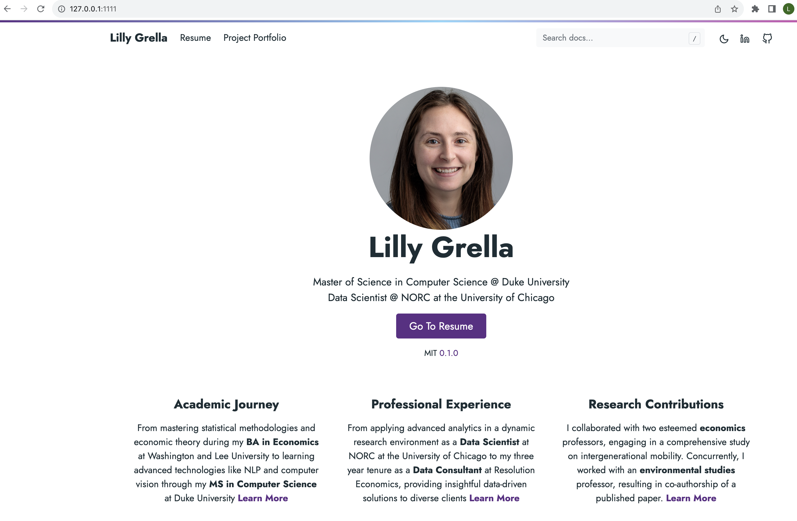
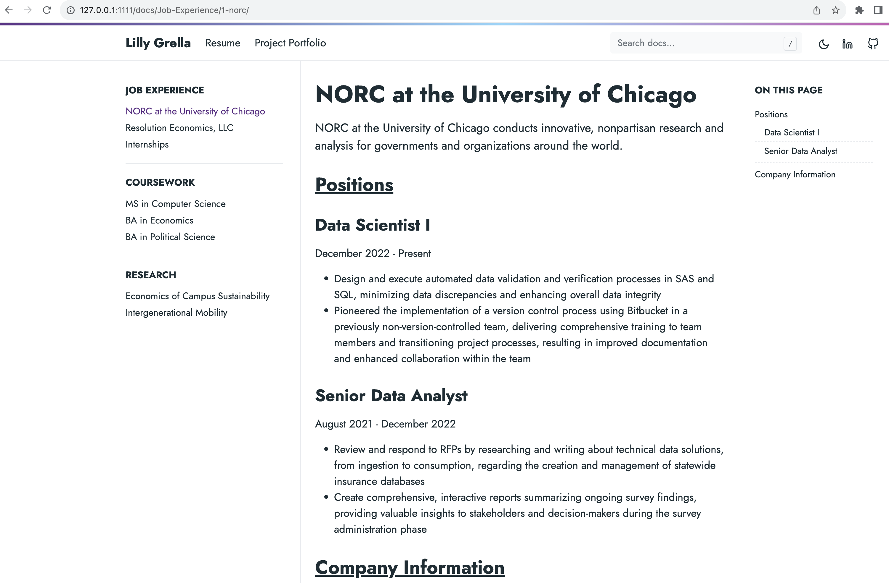
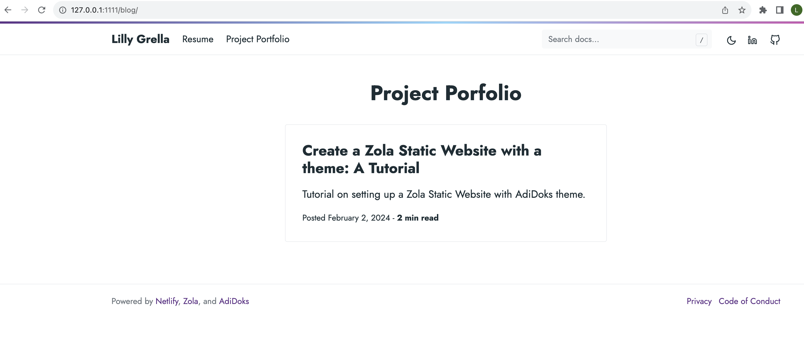

## Requirements

Before using the theme, you need to install the [Zola](https://www.getzola.org/documentation/getting-started/installation/) ≥ 0.15.0.

## Installation

### Step 1: Create a new zola site

```bash
zola init myblog
```

### Step 2: Install AdiDoks, a Zola theme

Download this theme to your themes directory

```bash
cd mysite/themes
git clone https://github.com/aaranxu/adidoks.git
```

### Step 3: Configuration

Copy the `config.toml.example` from the theme directory to your project's
root directory:

```bash
cp themes/adidoks/config.toml.example config.toml
```

### Step 4: Customize

Modify things like content, pages, and other details

### Step 5: Run the project

Just run `zola serve` in the root path of the project:

```bash
zola serve
```

AdiDoks will start the Zola development web server accessible by default at 
`http://127.0.0.1:1111`. Saved changes will live reload in the browser automatically.

### CI/CD has passed

### <u>Images of Running Static Website</u>

#### Homepage 

#### Resume 

#### Portfolio
